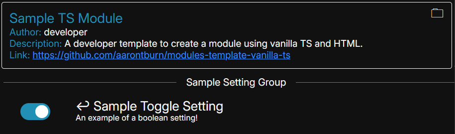

# Nexus: The Process

Regardless of what template you are using, the `process` remains unchanged.

## Overview
Nexus is built on [Electron](https://www.electronjs.org/) so modules must follow some of Electron's architectural rules — especially its [Process Model](https://www.electronjs.org/docs/latest/tutorial/process-model).

Your module will be split in two parts: The **process** and the **renderer**. 

- The process is the backend of your module. It can interact with the Node.js API, the filesystem, and external packages - but it **cannot interact with the DOM directly**.

- The renderer is the frontend of your module. It can manipulate the DOM and render your UI, but has **no direct access to the Node.js API**.

You will need to have the process and renderer work together to make a module. The API provided by Nexus makes this simple and easy to understand.

Utilizing [Inter-Process Communication](https://www.electronjs.org/docs/latest/tutorial/ipc), your process and renderer communicate through message-passing. This is already fully configured and all template repositories have these functions pre-written.


To communicate data from the process to renderer, it may look like this:  
> 1. The process wants to send arbitrary numbers to the renderer
> 2. Process invokes `this.sendToRenderer("number-event", 4, 5)`
> 3. Renderer catches the event in `handleEvent(eventType, data)`   
>       ↳ `eventType` = `"number-event"`   
>       ↳ `data` = `[4, 5]`   
> 4. Renderer displays the numbers in the UI. 

To communicate data from the renderer to the process:

> 1. A user clicks a button in the UI.
> 2. Renderer invokes  `sendToProcess("button-pressed", 1)`
> 3. Process handles this in `handleEvent(eventType, data)`   
>       ↳ `eventType` = `"button-pressed"`   
>       ↳ `data` = `[1]`   
> 4. Process can do something with the number. 

This section focuses on the `Process`.


## Getting Started
By default, the process is located in the `src/process` directory as `main.ts`.

Let's break down critical parts of this file.

### Imports
```typescript
// src/process/main.ts
//...

import { Process, Setting } from "@nexus/nexus-module-builder";
import { BooleanSetting } from "@nexus/nexus-module-builder/settings/types";

// ...
```
There is a set of classes and functions within `@nexus/nexus-module-builder` that may be useful to developing your module. Visit the [Process API](../../api/Process.md) to learn about all the available classes.


### Module Information
```typescript
// src/process/main.ts
// ...

// These is replaced to the ID specified in export-config.js during export. DO NOT MODIFY.
const MODULE_ID: string = "{EXPORTED_MODULE_ID}";
const MODULE_NAME: string = "{EXPORTED_MODULE_NAME}";
// ---------------------------------------------------
const HTML_PATH: string = path.join(__dirname, "../renderer/index.html");
// const ICON_PATH: string = path.join(__dirname, "...");
const ICON_PATH: string = undefined;

// ...
```
These constants are used to identify and create your module. 

- `MODULE_ID`: The ID of your module, usually in the form `<developer_name>.<module_name>`. Cannot contain whitespace or special characters, besides underscores.
- `MODULE_NAME`: The display name of your module. Can contain white spaces.
- `HTML_PATH`: The relative path to the renderers HTML file.
- `ICON_PATH`: The relative path to the modules icon. If this is undefined, the icon is replaced by the abbreviation of the `MODULE_NAME`. 
    - Can be a `svg`, `png`, `jpg`, or `jpeg`.

You may have noticed that `MODULE_ID` and `MODULE_NAME` are `"{EXPORTED_MODULE_ID}"` and `"{EXPORTED_MODULE_NAME}"`, respectively. These values are replaced during module building to the values defined in `export-config.js` (learn more [here](../../api/export-config.js.md)) and **should not be modified.**


### The Process Class
```typescript
// src/process/main.ts
// ...

export default class SampleProcess extends Process {

    public constructor() {
        super(MODULE_ID, MODULE_NAME, HTML_PATH, ICON_PATH);
    }

    public initialize(): void {
        super.initialize(); // This should be called.
        // ...
    }

    // ...
}

// ...
```
This class contains all the logic relevant for your Process. The class name (`SampleProcess` by default) is not important and can be changed. However, it is important that this class is the `default` export and extends the parent class `Process`. This is required for the Nexus client to correctly load your module.

Notice how the `constructor` is very bare-bones. While the `constructor` is the entry point to your module, it takes time for the renderer to be initialized. Therefore, your `constructor` should NOT have logic that is pertinent to your GUI.

On the other hand, the `initialize` method is (by default) called when the renderer is initialized. This is where you can begin communicating with your renderer.

#### Renderer Event Handling
```typescript
// src/process/main.ts
// ...

export default class SampleProcess extends Process {
    // ...

    public async handleEvent(eventType: string, data: any[]): Promise<any> {
        switch (eventType) {
            // Called when renderer has finished initializing
            case "init": {
                this.initialize();
                break;
            }
            case "count": {
                console.info("Sample React App: Received 'count': " + data[0]);
                break;
            }

            default: {
                console.info(`Sample React App: Unhandled event: eventType: ${eventType} | data: ${data}`);
                break;
            }
        }
    }
    // ...
}

// ...
```
This is the function that receives messages sent from your renderer.
- `eventType`: The name of the event as a `string`.
- `data`: Any data sent back from your renderer as an array.

Notice how we handle `"init"` here. When the renderer finishes initialization, it will send an event with an `eventType` of `"init"`, which is how we know our renderer is ready. You can change when your process will initialize, but there isn't much reason to do so. You can also use `if` statements instead of `switch-case`, if you prefer.

Notice how the return type is `Promise<any>`. If you need to reply back to the renderer after receiving an event, anything that you `return` here will be replied, which can be handled in the renderer using `.then(...)`.

For example, in the renderer file:
``` typescript
sendToProcess("get-data").then((data) => {
  console.log("Received from process:", data);
});
```

#### Settings
```typescript
// src/process/main.ts
// ...

export default class SampleProcess extends Process {
    // ...

    public registerSettings(): (Setting<unknown> | string)[] {
        return [
            "Sample Setting Group",
            new BooleanSetting(this)
                .setDefault(false)
                .setName("Sample Toggle Setting")
                .setDescription("An example of a true/false setting.")
                .setAccessID('sample_bool'),
        ];
    }

    public refreshSettings(modifiedSetting: Setting<unknown>): void {
        if (modifiedSetting.getAccessID() === "sample_bool") {
            this.sendToRenderer('sample-setting', modifiedSetting.getValue());
        }
    }

    // ...
}

// ...
```
The Nexus API provides an quick and easy way to add settings that the user may want to tweak. The `registerSettings` function is how you can register settings for your module.

The current implementation will result in a UI like this:


In order, if you provide a `string`, it will result in a section header. If you provide an `Setting`, it will be a fully functional setting. 

There are many different types of `Settings`, such as `BooleanSetting` for true/false, `StringSetting` for text input, `ChoiceSetting` for either radio buttons or dropdowns, etc.. Most default HTML `<input>` types are supported, however you are able to create your own settings. Visit the [Settings API](../../api/Settings.md) to learn more.

Each `Setting` may have its own configurations, but all settings must have a:
- Display Name (set via `setName()`)
- Default Value (set via `setDefault()`)
- Access ID (set via `setAccessID`) (not technically required, but if this value isn't set, the ID of the setting will be its display name, which is error prone during development).


The `refreshSettings` function is called whenever a Setting belonging to your module is modified, with the input being the setting modified. You can handle this change by retrieving the new value of the setting via `modifiedSetting.getValue()`, and update your process and renderer accordingly.

### Communicating with the Renderer
To send data to your renderer, the following function is provided from within your Process:

`this.sendToRenderer(eventType: string, ...data: any[])`

Similar to how you receive events in your process, this sends information to your renderer. More information can be found in the next section.

---
There are many more functions in the parent `Process` class that you can override, such as `onGUIShown`, `onGUIHidden`, `onExit`, and more. Visit the [Process API](../../api/Process.md) for more documentation about all the functions you can use.

## Next Steps
Learn about the renderer for your respective template.

### [Nexus: React Template](./react/2%20ReactRenderer.md)  
### [Nexus: Vanilla TS Template](./vanilla/2%20VanillaRenderer.md)
### [Nexus: Internal Template](./internal/3%20InternalRenderer.md)
### [Nexus: Webpage Template](./webpage/3%20WebpageRenderer.md)
