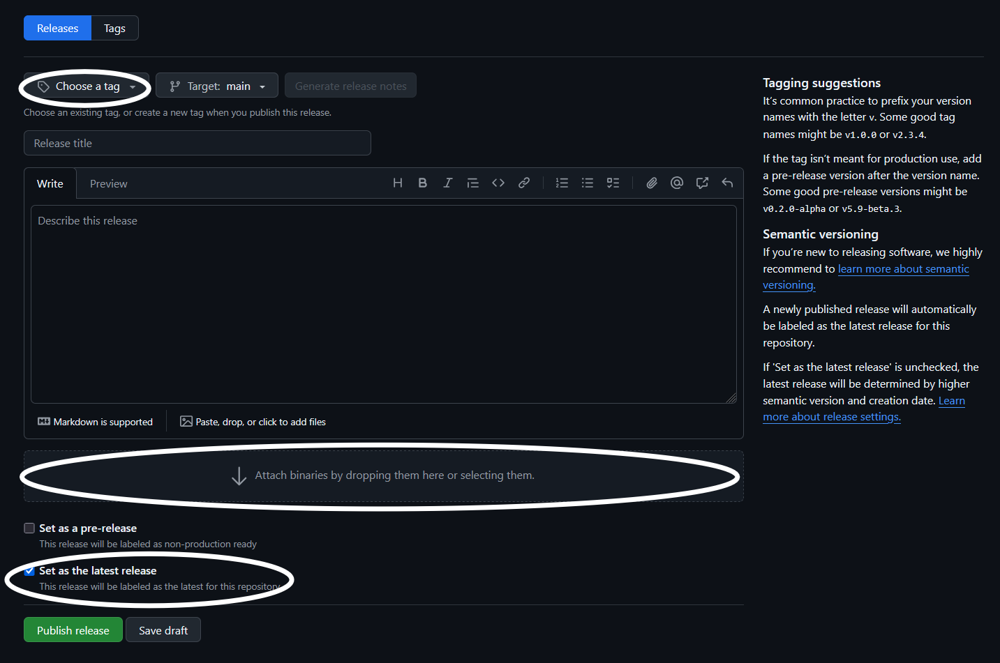

# Nexus: Remote Module Updating

## Overview
Enabling remote module updating for your module is quite simple.


## Requirements
The only external requirement is a GitHub account and a public repository to publish your release to.

## Getting Started

### 1. `module-info.json`
In your modules' `module-info.json`, you will need to add a new field, `"git-latest"` to the root of your file. Also ensure your `"version"` field is correctly set.

```jsonc
//  https://github.com/aarontburn/nexus-debug-console
{
    "name": "Debug Console",
    "id": "aarontburn.Debug_Console",
    "version": "1.0.1",
    // ...
    "git-latest": {
        "git-repo-name": "nexus-debug-console",
        "git-username": "aarontburn"
    },
    "build": {
        // ...
    }
}
```

`"git-latest"` will have two fields:

```jsonc
"git-latest": {
    "git-repo-name": "Your GitHub Repository Name",
    "git-username": "Your GitHub Username"
}
```

This is all the configuration for the `module-info.json`.

### 2. GitHub
1. On the homepage of your repository, create a new release.



2. Set the tag to be the **version in your module-info.json**. The tag should match **exactly.**
3. Attach your exported module `.zip` file as the **only** file in the release.
4. Ensure the "Set as the latest release" checkbox is checked.
6.  Publish your release.

The other fields (release title, description) are optional and can be customized/omitted.  

---

Thats it! Whenever you post a new release of your module, users can now remotely install updates from the "Manage Modules" screen in the settings. 